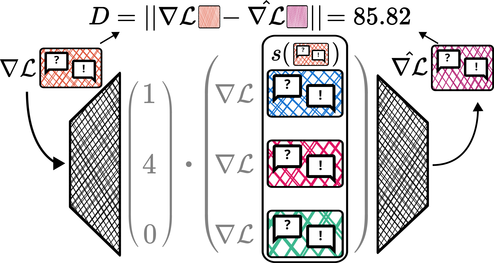

# Compact Example-based Explanations For Language Models

Repository for the paper *Compact Example-based Explanations For Language Models*.
## Setup
All scripts run inside Docker containers. The provided scheduling scripts (`*.sbatch, run.sh`) are for a SLURM cluster using the [pyxis](https://github.com/NVIDIA/pyxis) SPANK plugin. 
1. Build `Dockerfile` and `Dockerfile_eval`
2. Push them to a Docker registry as `ceelm:latest` and `ceelm:eval`
3. Create an `.env` file

## Fine-tuning

1. Tokenize dataset for finetuning: `./schedule.sh tokenize_ft.sbatch`
2. Run `!WANDB_PROJECT="ceelm_finetuning" python3 -m wandb sweep sweep.yaml`
3. Copy the returned sweep ID to `finetune.sbatch`, then run `./schedule.sh finetune.sbatch`
4. Schedule `./schedule.sh finetune.sbatch`
5. Clone the [OLMES](https://github.com/allenai/olmes) benchmark: `git clone https://github.com/allenai/olmes.git`
6. Schedule benchmark jobs: `./finetuning_eval.sh`

## Training Data Influence Estimation
1. Take a sample of the dataset for influence estimation and evaluation: `python3 take_split.py`
2. Obtain influence estimates: `./schedule.sh estimate_influence.sbatch`

## Selection Relevance Scoring ($\xi^{\mathcal{SR}}$) and Validation Experiment ($\xi^{+}$ and $\xi^{JSD}$)
Configuration in `load_experiment_data.py` and `*.sbatch` files.
1. Schedule jobs: `./run.sh`
2. Check progress with `progress.ipynb` (after running `./schedule.sh merge_results.sbatch`)
2. Once everything is done: `./schedule.sh merge_results.sbatch`

## Evaluation
1. Run `./schedule.sh run_notebooks.sbatch` to generate tables and figures
2. See `./out/*.ipynb`, `figures`, and `tables`